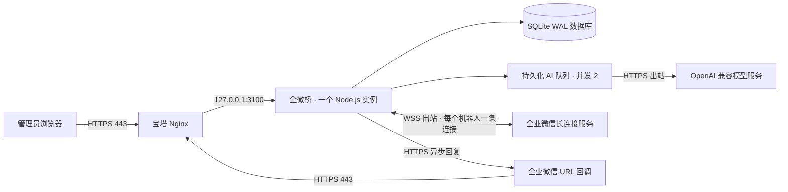

# 腾讯云 2 核 2GB + 宝塔：部署与接入手册

## 1. 推荐方案

系统采用 OpenCloudOS 9，保留腾讯云宝塔面板，使用宝塔 Nginx 管理域名、TLS 证书与反向代理。应用使用 Node.js 22 单进程，同时提供 React 静态文件、管理 API、回调接入、AI 队列和长连接维护；SQLite 数据库使用 WAL 模式持久化。



不要同时使用 PM2 管理、宝塔自动创建的 Node 进程管理器和 Docker 启动同一个项目，三者选一种。首选宝塔 Node 项目管理的**单进程**或 PM2 fork 单进程；可选 Docker Compose 仅用于已有容器运维经验的情况。

## 2. 资源安排

下表是初始规划，非压测保证。后台“今日”统计使用服务器进程时区，统一设置 `TZ=Asia/Shanghai`。

| 组件 | 建议内存预算 | 实例数量 |
| --- | --- | --- |
| OpenCloudOS + 宝塔 + Nginx | 约 500–800MB，取决于已装插件 | 各 1 |
| Node.js 应用 | 目标 150–350MB；V8 堆上限 384MB，PM2 RSS 超 512MB 重启 | 1 |
| SQLite | 随应用，WAL 文件和历史消息使用磁盘 | 1 本地文件库 |
| 系统文件缓存、升级和临时余量 | 尽量保留 500MB 以上可用内存 | — |

- AI 推理全部调用外部 API，不在这台主机部署模型。
- 不新增 Redis、MySQL、Java JVM 或 PHP 运行栈。现有服务是否停用由你根据用途决定。
- 构建前端最好在本地/CI 完成，再上传 `dist`；2GB 主机安装和构建时会有内存峰值。
- 当前是起步规模架构，没有并发容量承诺。观察 CPU、RSS、队列等待、模型耗时、磁盘占用后再决定扩容。

## 3. 上线前需要准备

1. 可用域名，例如 `bot.example.com`，A 记录解析到腾讯云公网 IP。境内云服务器使用域名提供网站时，按腾讯云要求完成备案；境外主机依据所在地和服务商要求配置。
2. 腾讯云安全组及本机防火墙允许 80（证书签发/跳转）、443（正式访问）；3100 不对公网开放。宝塔管理端口限制到自己的管理 IP。
3. 企业微信智能机器人 API 模式权限及该机器人的凭证。
4. 外部兼容 OpenAI 的模型基础地址、模型 ID 和 API Key。
5. 服务器允许出站访问 `qyapi.weixin.qq.com:443`、`openws.work.weixin.qq.com:443` 和模型供应商域名。先验证服务器到模型服务商的网络可达性。

## 4. 部署项目文件

建议目录 `/www/wwwroot/wecom-bridge`。上传以下文件，**不要上传本地 `.env`、`data`、`node_modules`、测试截图**：

```text
server/
scripts/
deploy/
dist/
package.json
package-lock.json
.env.example
```

本地生成 `dist`：

```bash
npm ci
npm run build
```

在宝塔安装最新 Node.js 22 LTS（至少 22.16），确认终端 `node -v` 使用正确版本。服务器执行：

```bash
cd /www/wwwroot/wecom-bridge
npm ci --omit=dev
npm run setup
chmod 600 .env
```

通过宝塔文件编辑器修改 `.env`：

```dotenv
NODE_ENV=production
HOST=127.0.0.1
PORT=3100
PUBLIC_URL=https://bot.example.com
ADMIN_PASSWORD=保留自动生成的随机管理员密码
ENCRYPTION_KEY=保留自动生成的64位十六进制密钥
DATA_DIR=/www/wwwroot/wecom-bridge/data
TZ=Asia/Shanghai
```

这里的域名需要替换为真实域名，密码和主密钥必须保留真实自动生成值。`PUBLIC_URL` 必须与浏览器最终访问的协议、域名、端口完全一致，否则 POST 来源校验会拒绝请求。

推荐使用无 root 权限的独立运行用户，将项目数据目录和 `.env` 授权给该用户；不要给 `.env` 全员读权限，也不要将项目源代码目录直接配置成公开下载目录。

## 5. 启动单实例

### 方案 A：宝塔 Node 项目管理

- 项目路径：`/www/wwwroot/wecom-bridge`
- 启动命令：`node --env-file=.env --max-old-space-size=384 server/index.js`
- Node 版本：最新 22 LTS
- 环境：生产
- 端口：3100
- 实例数量：1，禁止 cluster
- 配置开机启动和异常自动重启。

宝塔不同版本的 Node 管理插件字段可能不同；确保最终命令如上、工作目录正确、进程只有一个即可。

### 方案 B：已有 PM2 时

```bash
cd /www/wwwroot/wecom-bridge
pm2 start deploy/ecosystem.config.cjs
pm2 save
```

按照 `pm2 startup` 提示设置当前运行用户的开机启动。不要同时启用方案 A。

更新发布使用 `pm2 restart wecom-bridge`，不要使用 cluster reload 或零停机双实例部署；长连接切换会短暂中断，随后重新订阅。生产日志需要配置轮转。

### 方案 C：可选 Docker Compose

有 Docker 环境时，修改 `.env` 中真实域名、密码、加密主密钥，运行：

```bash
docker compose up -d --build
docker compose logs --tail=50 app
```

Compose 将端口只绑定到主机 `127.0.0.1:3100`，数据使用 `bridge-data` 命名卷，应用内存限额为 512MB。不要执行 `docker compose down -v`，这会删除数据卷。此方案同样使用宝塔 Nginx，不再额外启动第二个 Nginx 容器。Docker 镜像构建和容器启动配置已提供，但本次尚未在腾讯云 Docker 环境执行验证。

## 6. 宝塔 Nginx 配置

1. 宝塔“网站”添加真实域名的站点，不需要 PHP。
2. 申请并启用 SSL 证书，开启强制 HTTPS，确认自动续期任务。
3. 在站点 **HTTPS server 块**内应用 [nginx-location.conf](../deploy/nginx-location.conf)。替换原有 `location /`，不要重复添加。
4. 保存并检查 Nginx 配置语法，重新加载 Nginx。
5. 访问 `https://真实域名/api/health` 应返回 `{"ok":true}`，然后打开首页和控制台。

回调路由关闭 Nginx access log，避免签名、随机串和验证参数留在日志。长连接由 Node 向企业微信发起，不需要在 Nginx 增加 WebSocket Upgrade 配置。登录限流目前使用应用看到的 TCP 来源 IP；反代下为整个站点共享限制（每 15 分钟 15 次），适用于当前单管理员版本。

## 7. 接入机器人

### URL 回调

1. 企业微信后台选择智能机器人 API 模式 → 设置接收消息 URL。记录 BotID、Token、EncodingAESKey。
2. 企微桥 → 机器人管理 → 接入机器人 → URL 回调，填写凭证，保存并启用。
3. 复制生成的地址，例如 `https://bot.example.com/callbacks/wecom?bot=内部UUID`。
4. 将完整地址（含 `?bot=` 查询参数）填入企业微信，Token 和 EncodingAESKey 与网站保持一致。
5. 点击企业微信保存；后台执行 GET 验证，网站状态变成“验证通过”。
6. 在网站 AI 模型配置保存服务商配置，测试后开启自动回复。
7. 企业微信发送文本消息，网站消息中心应先显示 AI 排队/生成，随后为“已回复”。

同一个 `response_url` 最多调用一次，有效期 1 小时。URL 回调先持久化并返回空包，然后通过 response_url 回复。图片、文件、事件只记录基础信息，不自动调用模型。没有 response_url 的消息不能使用本版异步回复流程。

### 长连接

1. 企业微信后台选择 API 模式 → 长连接，获取 BotID 与专用 Secret。
2. 网站创建长连接机器人并启用。
3. 应用连接 `wss://openws.work.weixin.qq.com`，发送 `aibot_subscribe`，成功后显示“已连接”。
4. 每 30 秒发送 JSON `ping`，ACK 超时会重新建立连接。重连退避约 2/4/8/16/32/60 秒并附加抖动。
5. 如出现“认证失败”，先停用并修改凭证；如出现“连接被替代”，先关闭外部重复实例，再在网站停用/启用恢复。程序不会和其他实例反复争抢。
6. 保存模型配置并开启自动回复，再从企业微信发一条文本消息。

收到普通消息后使用回调 req_id 调用 `aibot_respond_msg`，等待 ACK。当前限制每条消息一次成功提交；另按会话计数限制 30 次/分钟、1000 次/小时，实际平台限额仍由企业微信最终执行。

## 8. AI 模型设置

- 基础地址：包含供应商要求的前缀，如 `https://api.openai.com/v1`、其他兼容供应商自己的地址。程序追加 `/chat/completions`。
- 模型：填写服务商支持的精确 model ID。
- API Key：保存在 SQLite 加密配置内。留空保存会保留原 Key，查询接口不回传明文。
- 提示词：定义业务助手身份和回复范围。
- 点击“测试已保存配置”会实际调用一次模型（可能计费）；再开启 AI 自动回复并保存。

本版使用非流式 `chat/completions`、`max_tokens=1500`，不携带历史上下文。并非所有标注“兼容”的服务都支持完全相同的参数；需真实测试确认。请求 60 秒超时、生成结果最大 20480 UTF-8 字节，超限/错误均进入失败记录，可人工接管。

## 9. 数据与备份

SQLite 文件在 `DATA_DIR`。运行时有 `bridge.sqlite`、`bridge.sqlite-wal`、`bridge.sqlite-shm`，不要只复制运行中的主数据库文件。用提供的在线备份脚本：

```bash
cd /www/wwwroot/wecom-bridge
node --env-file=.env scripts/backup.js /www/backup/wecom-bridge
```

建议宝塔计划任务每天执行，并保留 7–30 天备份。将 `.env` 的加密主密钥另行保存在受控的密码管理器中；数据库备份和密钥不要公开存放到同一下载地址。数据库含聊天明文，COS 备份桶应为私有。

恢复时先停止应用，归档当前数据库及 WAL/SHM 文件，再用一致性备份恢复主数据库并配回原 `ENCRYPTION_KEY`。确认没有旧进程后再启动，避免旧 WAL 被错误应用。

当前无消息自动清理；监控数据目录和备份磁盘大小。主密钥没有在线轮换功能，不能直接替换后继续使用原数据库。

## 10. 验收与后续扩容

- 首页和后台 HTTPS 正常，未登录无法访问管理数据。
- 错误回调签名被拒绝，正确 URL 验证成功。
- 每种模式各使用真实机器人收发一次，AI 回复和消息记录一致。
- 重复回调只出现一条记录；人工接管与 AI 不重复发送。
- 长连接断网后恢复；同 BotID 在别处登录时本实例进入被替代状态。
- 服务重启后机器人恢复连接，待处理任务继续；发送结果未知的消息不自动重试。
- 观察宝塔内存、磁盘、证书续期和数据库备份。

**单台服务器不是高可用部署。** 后续升级到多实例时，需要迁移共享数据库，增加队列抢占、机器人连接租约/ fencing、共享会话、出站幂等记录和统一限流。不能简单增加 PM2 workers 或复制 SQLite 容器。

官方参考（核对日期 2026-09-18）：

- https://developer.work.weixin.qq.com/document/path/101138
- https://developer.work.weixin.qq.com/document/path/101463
- https://developer.work.weixin.qq.com/document/path/101033
