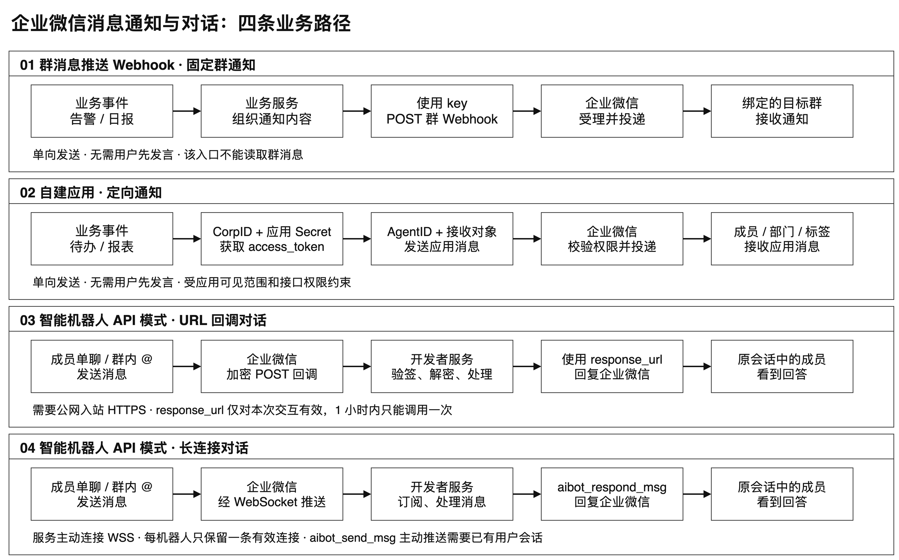
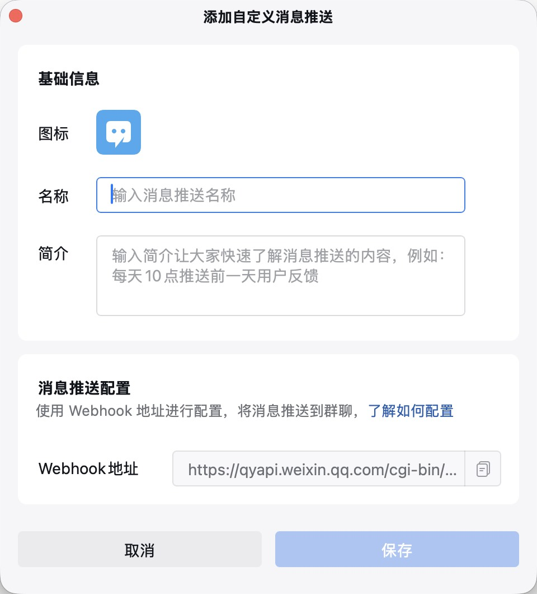
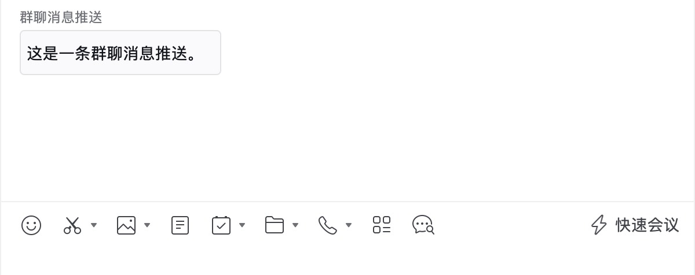
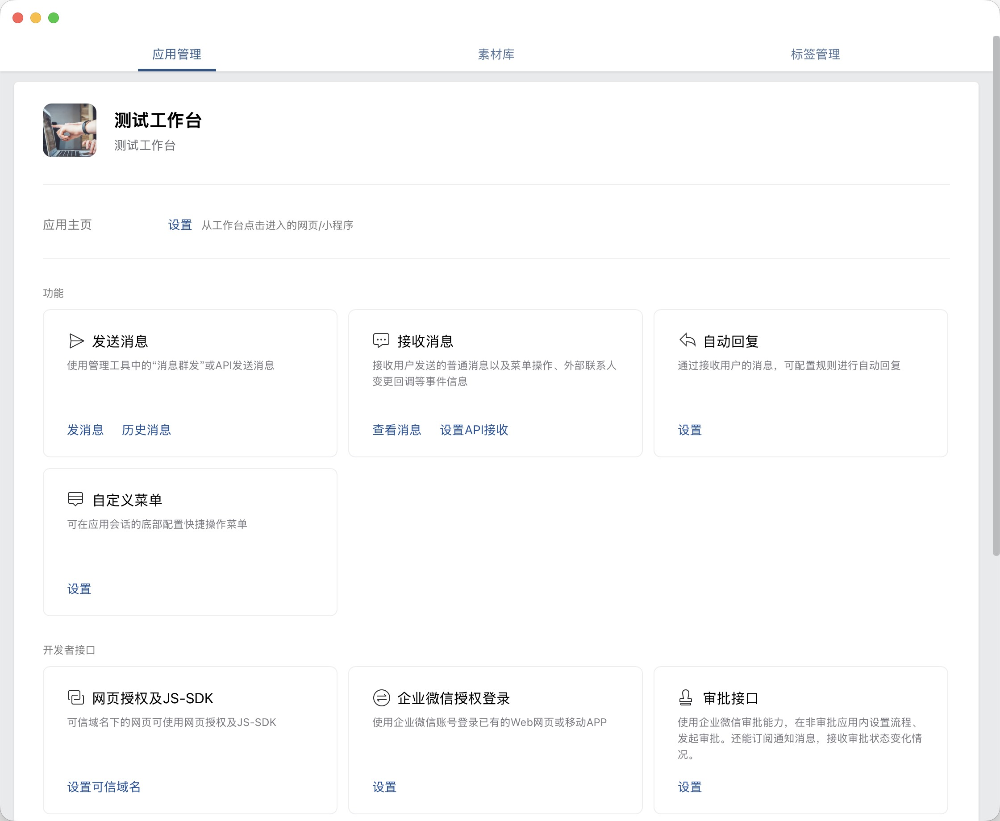
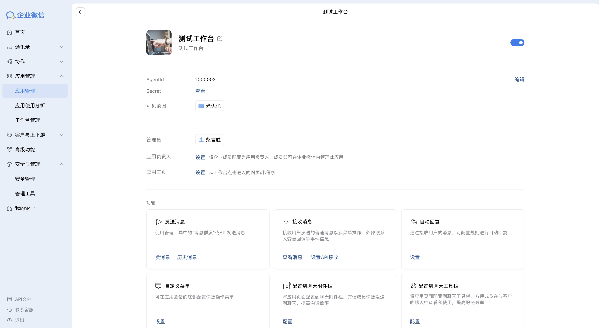
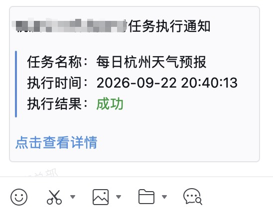
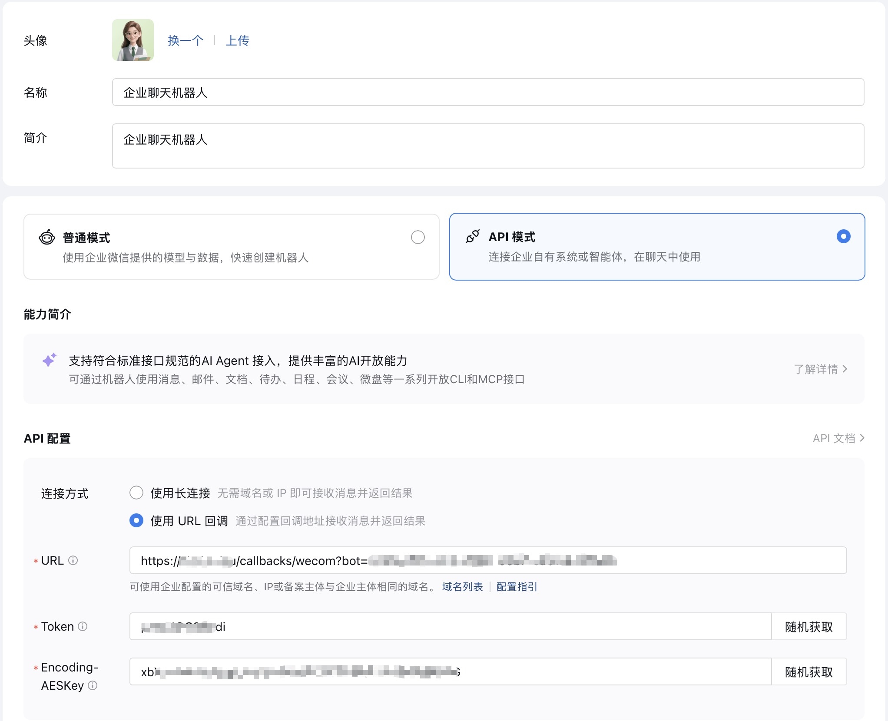
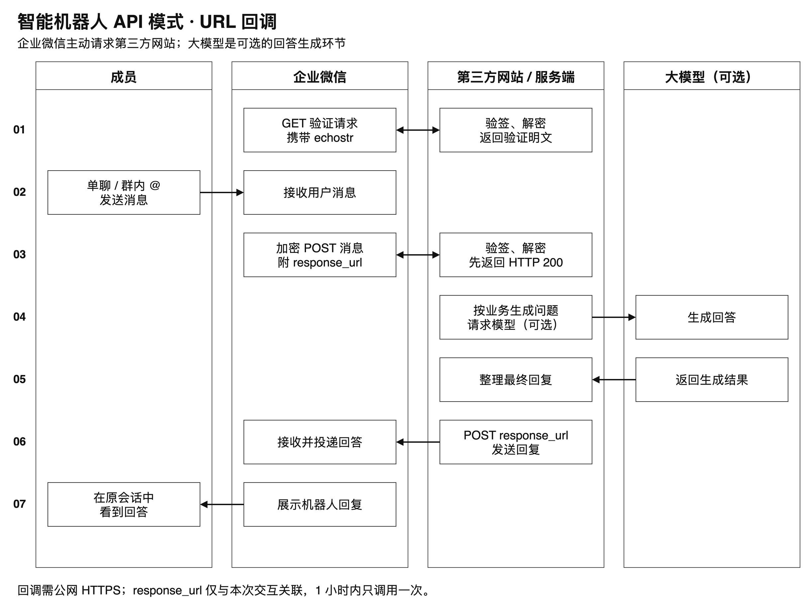
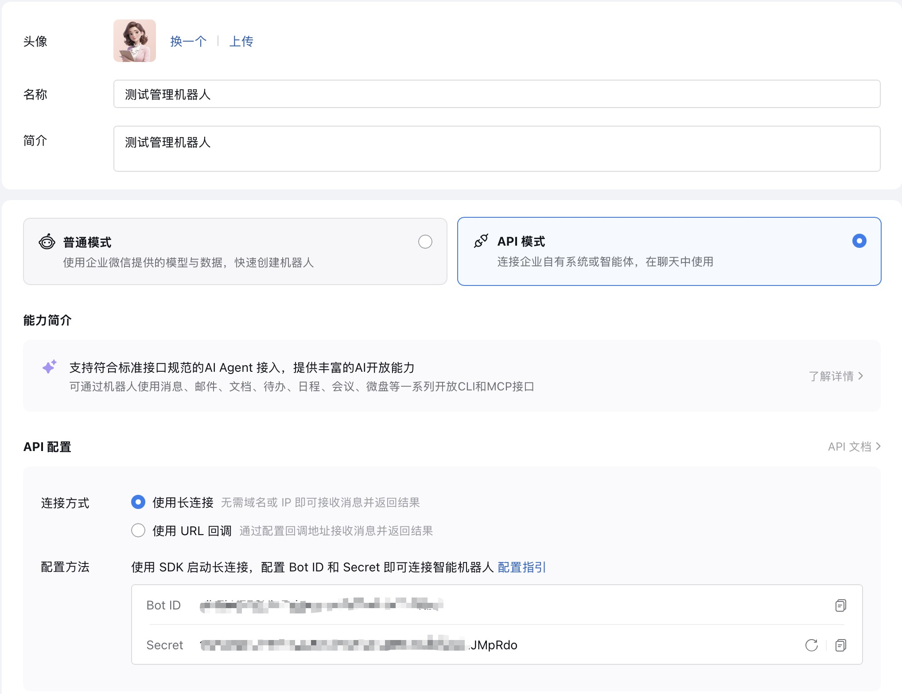
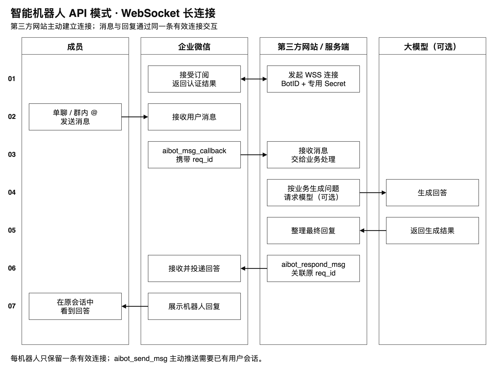

# 企业微信消息通知与对话：消息推送、应用通知和智能机器人

一条群消息通知、一份发给同事的定时报表、一个可以直接聊天的 AI 助手，都可以出现在企业微信里，但它们背后的接入方式并不相同。

这篇文章按三个实际需求展开：向群里发送通知，用消息推送 Webhook；向指定成员、部门或标签发送业务通知，用自建应用；需要接收用户输入并回答问题，用智能机器人 API 模式。重点是各入口的配置、鉴权、收发能力及使用限制。

这些能力与编程语言无关：消息推送和应用通知通过 HTTPS 接口调用，智能机器人通过 HTTP 回调或 WebSocket 与业务服务交互。Node.js、Java、Python 等语言都可以实现。



## 一、先分清这三种方式

| 比较项 | 群消息推送 Webhook | 自建应用通知 | 智能机器人 API 模式 |
| --- | --- | --- | --- |
| 典型用途 | 部署结果、监控告警、群日报 | 指定成员通知、部门提醒、业务待办 | 单聊问答、群内 @ 问答、AI 助手 |
| 主要发送/回复入口 | `/cgi-bin/webhook/send` | `/cgi-bin/message/send` | URL 回调后的回复，或 WebSocket 消息回复 |
| 配置凭证 | Webhook 地址中的 key | CorpID、应用 Secret、AgentID | URL：Token、EncodingAESKey；长连接：BotID、专用 Secret |
| 接收目标 | Webhook 所绑定的群 | 应用权限范围内的成员、部门、标签 | 用户与机器人的单聊或所在群会话 |
| 是否要用户先发消息 | 不需要 | 不需要 | 回复需要先有用户消息；长连接主动推送也要求用户曾在该会话发过消息 |
| 是否需要公网入站服务 | 不需要 | 仅发送通知不需要 | URL 模式需要；长连接由服务主动连接企业微信 |
| 接收用户消息的方式 | 该推送接口不提供接收能力 | 需另行配置和开发应用回调 | URL 回调或长连接 |

常被称为“群机器人 Webhook”的这类入口，当前官方文档名称是“消息推送配置说明”。它提供向群发送消息的能力，不等于能读取群聊天的智能机器人。本文把用户口中的“消息通知”对应到这一类群消息推送。

自建应用也可以扩展回调和交互功能，不能笼统地说“应用只能通知”。这里使用的是其中的**发送应用消息接口**。

## 二、消息通知：用 Webhook 向群里推送

### 1. 配置清单：固定群、推送名称和 Webhook

群消息推送适合“业务系统有结果，就向某个固定群发一条消息”。群与推送配置之间的关系由企业微信维护，调用时不需要再指定群 ID。



| 配置项 | 在哪里配置 / 获取 | 作用 |
| --- | --- | --- |
| 目标群 | 企业微信中允许创建消息推送的群 | 决定通知发到哪里 |
| 推送名称等展示信息 | 创建消息推送时设置 | 让群成员识别消息来源 |
| 完整 Webhook URL | 创建页、创建完成页或详情页复制 | 发送接口，地址中的 key 同时承担鉴权作用 |
| 消息类型 `msgtype` | 业务请求体 | 选择文本、Markdown、图片等类型 |
| 消息内容 | 业务请求体 | 实际发送的正文或对应类型的数据 |
| 提醒对象，可选 | 文本消息的 `mentioned_list` / `mentioned_mobile_list` | 指定需要 @ 的群成员 |
| 网络与发送频率 | 发送程序所在环境 | 能访问企业微信 HTTPS 接口，并按接口规则限流 |

这一方式不需要 CorpID、AgentID、应用 Secret，也不需要搭建接收消息服务器。所需参数及消息类型见第七章官方文档表。

**实际配置顺序：**

1. 在目标群可用的消息推送入口创建配置，设置便于识别的名称。
2. 复制完整 Webhook，保存到业务系统的环境变量或密钥配置中。
3. 选择要发送的消息类型，组织请求 JSON。
4. 从业务服务器发送一条测试通知，检查接口结果和目标群中的展示。
5. 验证成功后，再接入定时任务、业务事件或人工触发按钮。

Webhook 的形式如下：

```text
https://qyapi.weixin.qq.com/cgi-bin/webhook/send?key=你的消息推送密钥
```

这个地址本身就包含发送凭证。不要把真实地址放进博客、Git 仓库或截图中，也不要把智能机器人的接收消息 URL 填到这里。

### 2. 发送的本质是一次 HTTP POST

文本消息使用下面的 JSON 结构；调用方还可以按官方文档发送 Markdown、图片、文件等类型。

```json
{
  "msgtype": "text",
  "text": {
    "content": "这是一条群聊消息推送。"
  }
}
```

文本长度按 UTF-8 **字节数**计算，上限为 2048，常见汉字通常占 3 个字节，超过会自动截断；企业微信开发者文档规定每个消息推送最多 20 条/分钟。批量通知应先合并、限流，不要用不断重试替代限流。

接口只有在 HTTP 200 且 JSON 中 `errcode=0` 时才确认受理。请求超时的结果可能未知，不宜立即盲目重发；接口受理也不等于群成员已阅读。如下图就是推送后群内显示的消息内容：



## 三、应用通知：将消息发给指定成员

### 1. 配置清单：应用身份、权限、网络和接收对象

在企业管理后台创建或选择一个自建应用，配置允许使用它的成员范围，准备以下值：



| 配置 | 用途 |
| --- | --- |
| CorpID | 标识企业，用于获取应用的 access_token |
| AgentID | 指定发送消息的应用，是整数 |
| 应用 Secret | 获取该应用的 access_token，不能公开 |
| 成员 UserID | 指定接收者，多人用 `\|` 分隔 |
| 部门 ID / 标签 ID | 按部门或标签通知，可选 |
| 应用启用状态与可见范围 | 决定哪些成员具备接收权限 |
| 接收成员的接口许可 | 发送部分失败时核对相关权限与许可 |
| 企业可信 IP | 允许调用自建应用接口的服务器出口 IP |
| access_token 缓存 | 按应用隔离并按有效期刷新，不需要人工填写 token |
| 通知类型与内容 | 在请求体中指定 text、Markdown 等类型及正文 |
| 去重与调度，可选 | 控制重复通知、发送时机和频率 |

发送者使用应用自身的 Secret 获取 token；应用 token 不能随意跨应用混用。接收者还需满足应用可见范围和接口权限要求。

成员 UserID 不是昵称，也不要默认拿手机号代替。调用遇到 `60020` 时，核对应用的企业可信 IP 等访问配置，以及服务器实际出口 IP；通过代理出网时，出口 IP 可能与服务器网卡地址不同。

**实际配置顺序：**

1. 由具备管理权限的人员，在企业管理后台的应用管理中创建或选择自建应用，确认应用已启用。
2. 设置应用名称、展示信息和可见范围，先将用于测试的成员纳入范围。
3. 在企业信息中取得 CorpID，在应用详情中取得 AgentID 和该应用的 Secret。
4. 配置企业可信 IP，填写运行通知程序的服务器实际出口 IP。
5. 从企业通讯录等管理信息中确认目标成员 UserID，或准备部门 / 标签 ID。
6. 将凭证和接收对象配置到业务系统，先获取 token，再发送测试消息。
7. 检查接口返回和成员客户端；部分失败时继续排查可见范围、成员标识和接口许可。

仅调用“发送应用消息”不需要配置接收消息 URL、Token、EncodingAESKey，也不需要为了发通知先部署应用主页。若后续要接收成员发给应用的消息，或处理交互事件，那是另一项回调配置与开发工作。



核对应用名称、AgentID 和可见范围，注意隐藏 Secret。

### 2. 获取 token，再发送消息

调用链路如下：

```text
业务系统（Node.js、Java、Python 等）
  ├─ CorpID + 应用 Secret → 获取或复用 access_token
  └─ access_token + AgentID + 接收对象 → 发送应用消息
```

获取凭证的接口：

```text
GET https://qyapi.weixin.qq.com/cgi-bin/gettoken?corpid=企业ID&corpsecret=应用Secret
```

发送消息的接口：

```text
POST https://qyapi.weixin.qq.com/cgi-bin/message/send?access_token=应用访问凭证
```

以向成员发送 Markdown 消息为例，请求 JSON 如下；Node.js、Java 或 Python 均发送相同结构：

```json
{
  "touser": "zhangsan|lisi",
  "agentid": 1000002,
  "msgtype": "markdown",
  "markdown": { "content": "任务执行通知：今日报表已生成。" },
  "enable_duplicate_check": 1,
  "duplicate_check_interval": 600
}
```

这里的 AgentID 和成员 ID 都是占位示例。按部门、标签通知时使用 `toparty`、`totag`；接收权限不会因为请求里写了某个 ID 就自动放开。

token 应按应用缓存，以返回的 `expires_in` 为准，通常为 7200 秒；官方也提醒 token 可能提前失效。明确收到 token 无效或过期错误时，再刷新并按业务需要重试，避免每次发送都重新获取。



这类接收方看到的是应用消息，可以看到列表内有一个应用，应用有一条未读消息。

### 3. HTTP 成功不等于所有人都收到了

应用消息可能在 `errcode=0` 时同时返回 `invaliduser`、`invalidparty`、`invalidtag` 或 `unlicenseduser`，表示部分接收对象不合法、无权限或缺少相应许可。这是部分失败，不能直接报告“全部成功”。

应用接口还有独立的频率规则：当前文档列出同一应用对同一成员最多 30 次/分钟、1000 次/小时，并有按账号上限计算的每日人次限制。

## 四、智能机器人：接收消息并回复

群消息推送和自建应用通知主要解决“业务系统发消息”。要让成员直接向机器人提问、在群中 @ 机器人并收到回复，可以使用智能机器人 API 模式。它把收到的消息交给开发者服务处理；回答可以由规则、人工服务或 AI 模型生成，不要求必须接入大模型。

### 1. API 模式的两种接入方式

长连接和 URL 回调是**智能机器人 API 模式下的两种接入方式**，同一机器人只能选择一种；切换模式会使原模式失效。

| 比较项 | URL 回调 | WebSocket 长连接 |
| --- | --- | --- |
| 连接方向 | 企业微信请求开发者提供的 HTTPS 回调地址 | 开发者服务主动连接企业微信 |
| 所需凭证 | 回调 URL、Token、EncodingAESKey | BotID、长连接专用 Secret |
| 公网入站 | 需要能被企业微信访问的回调服务 | 不需要入站回调，但要能出站连接 WSS |
| 接收方式 | GET 验证地址，POST 接收加密消息 | 订阅成功后接收消息帧 |
| 回复方式 | 使用本次交互提供的 `response_url` | 使用 `aibot_respond_msg` 回复对应请求 |
| 运行要求 | 保持回调服务可用，校验签名并解密 | 保持长连接，处理心跳、断线和重连 |

机器人支持成员直接发送单聊文本，也支持群内 @ 机器人发送文本；单聊不需要先建立群。实际可见范围和使用资格应在企业微信侧确认。

### 2. URL 回调：由企业微信请求你的服务

在企业微信的智能机器人 API 模式中选择接收消息 URL，配置开发者的完整 HTTPS 回调地址（公网可达，并按要求完成备案）、Token 和 EncodingAESKey。服务端保存同一组凭证，用于验签和解密；这里不需要长连接的 BotID 与专用 Secret。



URL 回调的往返过程如下：企业微信先验证第三方网站的地址；成员发来消息后，企业微信将加密消息送到网站，网站处理完成后再通过本次消息的回复入口返回回答。图中调用大模型是可选的业务处理环节。



配置顺序是：准备可访问的回调地址与凭证，在服务端配置相同的 Token 和 EncodingAESKey，再到企业微信后台填写并验证 URL。GET 验证请求需要验签、解密 `echostr` 并返回明文；之后 POST 才会携带用户消息。生产环境应保护凭证、校验请求、处理企业微信的重复投递，并对发送失败或超时保留可追踪结果。

收到消息后，服务可以先确认接收，再根据业务结果回复。消息内的 `response_url` 是**该次交互的临时回复入口**，只能调用一次，有效期为 1 小时；它不是第二章的群通知 Webhook，也不能用于脱离用户消息的长期定时推送。

单聊消息不一定含群会话的 `chatid`，不要仅以是否存在这个字段判断消息是否合法。接收到的 `from.userid` 也可能是加密成员标识，不能不经转换就当作第三章应用消息的 `touser`。

第三方网站完成接收和回复后的对话效果：


### 3. 长连接：由服务主动订阅

在企业微信的智能机器人 API 模式中选择长连接，取得该机器人的 BotID 和**长连接专用 Secret**。服务端连接 `wss://openws.work.weixin.qq.com`，发送 `aibot_subscribe` 完成订阅认证，维持心跳并处理断线重连。它不使用 URL 回调的 Token、EncodingAESKey，也不要求提供入站回调地址。



与 URL 回调相比，长连接改由第三方网站主动连接企业微信并完成订阅；成员消息仍由企业微信传给网站，网站处理后沿连接回复。图中同样以可选的大模型生成回答为例。



每个机器人同时只保留一条有效长连接，新连接会替代旧连接。部署多进程或多台服务器时，应确保同一机器人只有一个有效连接，避免反复抢占。收到消息帧后，服务可通过 `aibot_respond_msg` 对应原请求进行回复。

长连接协议还提供 `aibot_send_msg` 主动推送，但前提是用户已经在对应会话中给机器人发过消息；它不能替代面向任意成员或固定群的通知接口。收到消息后的回复窗口为 24 小时；回复和主动推送共用单会话 30 条/分钟、1000 条/小时的限制。URL 回调的临时回复入口与长连接主动推送不是同一种能力。

完成订阅和回复后的实际对话效果：


## 五、怎么选与接入前核对

### 1. 向固定群发通知

使用群消息推送 Webhook。先确认 Webhook 绑定的群和 key 的保管方式，再按每个推送的频率限制发送。接口返回 `errcode=0` 后，还要在目标群核对消息；受理成功不代表成员已读。

### 2. 向指定成员、部门或标签发通知

使用自建应用消息。先核对 CorpID、AgentID、应用 Secret、应用可见范围、企业可信 IP 和接收对象。发送后既检查 `errcode`，也检查 `invaliduser` 等部分失败字段，并在目标成员客户端验证接收情况。

### 3. 让成员与机器人对话

使用智能机器人 API 模式。可提供公网 HTTPS 地址时选择 URL 回调，核对 GET 验证、POST 验签解密与临时 `response_url`；不能开放入站服务时选择长连接，核对 BotID、专用 Secret、出站 WSS、订阅与心跳状态。两种方式都要用单聊或群内 @ 消息验证接收及回复链路。

### 4. 管理凭证与不确定的发送结果

含凭证的 Webhook URL、Secret、access_token 和回调密钥不应进入仓库、公开截图或普通日志。发送接口超时可能意味着“已受理但没有收到响应”，重发前先核实结果或做好业务去重。

## 六、通知与对话的能力边界

### 1. 发送入口不等于接收入口

第二章的群 Webhook 只能向绑定的群推送，不能读取群成员的消息。第三章的自建应用发送接口也只负责发送；应用若要接收成员消息，需要另行配置和开发回调。智能机器人 API 模式才是本文讨论的机器人对话入口。

### 2. 机器人回复不等于任意群发

URL 模式的 `response_url` 依附于一次用户交互；长连接虽然提供主动推送，但也要求用户此前在对应会话中发过消息。无此会话前置条件的固定群通知或定向成员通知，应分别使用群消息推送或自建应用接口。

### 3. 成员身份与业务能力要分别处理

机器人消息中的 `from.userid` 可能是加密成员标识，不能直接填到应用消息的 `touser` 中。智能机器人接入后，消息解析、业务处理、AI 调用和多轮上下文也都要由开发者实现；协议支持某种消息类型，不代表接入服务自动具备相应的理解和回复能力。

## 七、企业微信官方参考文档

以下官方文档链接集中列出，可能随官方后续更新变化；调用限制与支持的消息类型以上线时的官方页面为准。

| 企业微信官方文档 | 本文对应内容 |
| --- | --- |
| [消息推送配置说明](https://developer.work.weixin.qq.com/document/path/91770) | 第一、二章：群 Webhook 的配置、消息体、文本长度和 20 条/分钟限制 |
| [获取 access_token](https://developer.work.weixin.qq.com/document/path/91039) | 第三章：自建应用凭证获取、按应用缓存与有效期 |
| [发送应用消息](https://developer.work.weixin.qq.com/document/path/90236) | 第一、三、五章：接收对象、重复检查、部分失败和调用频率 |
| [智能机器人接收消息](https://developer.work.weixin.qq.com/document/path/100719) | 第四章：单聊及群内 @、chatid 与成员身份字段 |
| [回调和回复的加解密方案](https://developer.work.weixin.qq.com/document/path/101033) | 第四章：GET 验证的 echostr、签名和 AES 解密 |
| [智能机器人主动回复消息](https://developer.work.weixin.qq.com/document/path/101138) | 第四章：URL 模式 response_url 的一次调用与一小时有效期 |
| [智能机器人长连接](https://developer.work.weixin.qq.com/document/path/101463) | 第四章：订阅、心跳、单连接、24 小时回复、主动推送及频率限制 |
| [自建应用与智能机器人的对接](https://developer.work.weixin.qq.com/document/path/101521) | 第四章：加密成员标识转换和应用可见范围 |
| [全局错误码](https://developer.work.weixin.qq.com/document/path/90313) | 第三章：60020、token 无效或过期 |
