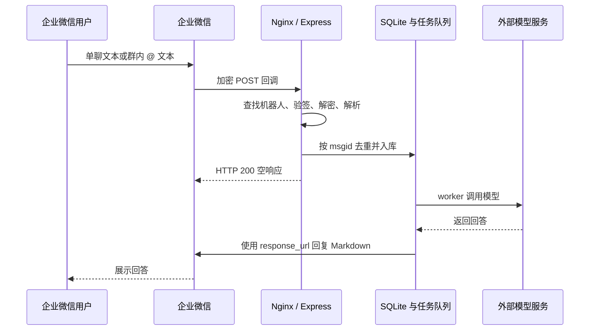

# 企业微信消息通知与对话：消息推送、应用通知和智能机器人

一条群消息通知、一份发给同事的定时报表、一个可以直接聊天的 AI 助手，都可以出现在企业微信里，但它们背后的接入方式并不相同。

这篇文章按三个实际需求展开：向群里发送通知，用消息推送 Webhook；向指定成员、部门或标签发送业务通知，用自建应用；需要接收用户输入并回答问题，用智能机器人 API 模式。消息通知部分使用 Python 编写调用示例，对话部分结合实际案例说明。

这些能力与编程语言无关：消息推送和应用通知通过 HTTPS 接口调用，智能机器人通过 HTTP 回调或 WebSocket 与业务服务交互。Node.js、Java、Python 等语言都可以实现。本文选择 Python 只是为了演示发送请求，接口参数、鉴权方式和消息处理规则同样适用于其他编程语言。

## 一、先分清这三种方式

| 比较项 | 群消息推送 Webhook | 自建应用通知 | 智能机器人 API 模式 |
| --- | --- | --- | --- |
| 典型用途 | 部署结果、监控告警、群日报 | 指定成员通知、部门提醒、业务待办 | 单聊问答、群内 @ 问答、AI 助手 |
| 本文采用的发送入口 | `/cgi-bin/webhook/send` | `/cgi-bin/message/send` | URL 回调后的回复，或 WebSocket 消息回复 |
| 配置凭证 | Webhook 地址中的 key | CorpID、应用 Secret、AgentID | URL：Token、EncodingAESKey；长连接：BotID、专用 Secret |
| 接收目标 | Webhook 所绑定的群 | 应用权限范围内的成员、部门、标签 | 用户与机器人的单聊或所在群会话 |
| 是否要用户先发消息 | 不需要 | 不需要 | 本项目回复流程需要；官方长连接另有主动推送能力，见后文 |
| 是否需要公网入站服务 | 不需要 | 仅发送通知不需要 | URL 模式需要；长连接由服务主动连接企业微信 |
| 接收用户消息的方式 | 本文使用的推送接口不提供接收能力 | 需另行配置和开发应用回调 | URL 回调或长连接，本项目已实现 |

常被称为“群机器人 Webhook”的这类入口，当前官方文档名称是“消息推送配置说明”。它提供向群发送消息的能力，不等于能读取群聊天的智能机器人。本文把用户口中的“消息通知”对应到这一类群消息推送。[官方消息推送说明](https://developer.work.weixin.qq.com/document/path/91770)

自建应用也可以扩展回调和交互功能，不能笼统地说“应用只能通知”。这里使用的是其中的**发送应用消息接口**。[发送应用消息](https://developer.work.weixin.qq.com/document/path/90236)

- 群内消息推送Webhook


- 自建应用设置


- 智能机器人API模式 - URL回调


- 智能机器人 - 长连接


> **截图位置 01：三种入口对照。** 放置群消息推送设置、自建应用详情、智能机器人 API 模式的截图。截图中隐藏 Webhook key、应用 Secret 和机器人密钥。

## 二、消息通知：用 Webhook 向群里推送

### 1. 配置清单：固定群、推送名称和 Webhook

群消息推送适合“业务系统有结果，就向某个固定群发一条消息”。群与推送配置之间的关系由企业微信维护，调用时不需要再指定群 ID。

| 配置项 | 在哪里配置 / 获取 | 作用 |
| --- | --- | --- |
| 目标群 | 企业微信中允许创建消息推送的群 | 决定通知发到哪里 |
| 推送名称等展示信息 | 创建消息推送时设置 | 让群成员识别消息来源 |
| 完整 Webhook URL | 创建页、创建完成页或详情页复制 | 发送接口，地址中的 key 同时承担鉴权作用 |
| 消息类型 `msgtype` | 业务请求体 | 选择文本、Markdown、图片等类型 |
| 消息内容 | 业务请求体 | 实际发送的正文或对应类型的数据 |
| 提醒对象，可选 | 文本消息的 `mentioned_list` / `mentioned_mobile_list` | 指定需要 @ 的群成员；本文脚本未封装这一可选功能 |
| 网络与发送频率 | 发送程序所在环境 | 能访问企业微信 HTTPS 接口，并按接口规则限流 |

这一方式不需要 CorpID、AgentID、应用 Secret，也不需要搭建接收消息服务器。所需参数及消息类型以[消息推送配置说明](https://developer.work.weixin.qq.com/document/path/91770)为准。

**实际配置顺序：**

1. 在目标群可用的消息推送入口创建配置，设置便于识别的名称。
2. 复制完整 Webhook，保存到业务系统的环境变量或密钥配置中。
3. 选择要发送的消息类型，组织请求 JSON。
4. 从业务服务器发送一条测试通知，检查接口结果和目标群中的展示。
5. 验证成功后，再接入定时任务、业务事件或人工触发按钮。

Webhook 的形式如下：

```text
https://qyapi.weixin.qq.com/cgi-bin/webhook/send?key=你的消息推送密钥
```

这个地址本身就包含发送凭证。不要把真实地址放进博客、Git 仓库或截图中，也不要把智能机器人的接收消息 URL 填到这里。[创建与调用说明](https://developer.work.weixin.qq.com/document/path/91770)


> **截图位置 02：群消息推送配置。** 展示创建入口、推送名称、关联群和 Webhook 所在位置，将 key 整段打码。

### 2. 发送的本质是一次 HTTP POST

文本消息使用下面的 JSON 结构；调用方还可以按官方文档发送 Markdown、图片、文件等类型。本文脚本只实现文本，方便先验证链路。[消息类型与格式](https://developer.work.weixin.qq.com/document/path/91770)

```json
{
  "msgtype": "text",
  "text": {
    "content": "这是一条群聊消息推送。"
  }
}
```

文本长度按 UTF-8 **字节数**计算，上限为 2048，一个中文按照3个字节计数，超过会自动截断；企业微信开发者文档规定每个消息推送最多 20 条/分钟。批量通知应先合并、限流，不要用不断重试替代限流。[长度与频率限制](https://developer.work.weixin.qq.com/document/path/91770)

### 3. 调用示例：使用 Python 发送通知

本文提供一个脚本，同时支持 `group` 和 `app` 两种通知。完整代码在第七节 `wecom_notify.py` 。

在项目根目录安装依赖：

```bash
python3 -m venv .venv
source .venv/bin/activate
python -m pip install requests
```

使用 Bash 隐藏输入 Webhook，避免把真实密钥直接写进命令历史：

```bash
export WECOM_WEBHOOK_URL='https://qyapi.weixin.qq.com/cgi-bin/webhook/send?key=你的消息推送密钥'
python scripts/examples/wecom_notify.py group '这是一条群聊消息推送。'
```

脚本检查 HTTP 状态和 JSON 中的 `errcode`。只有 HTTP 200 并且 `errcode=0` 才认为接口确认受理；请求超时则报告结果可能未知，不自动重发。接口受理成功不代表群成员已经阅读。


> **截图位置 03：群消息通知发送效果。** 左侧放命令执行结果，右侧放群里收到的通知；不要展示带 key 的完整命令或地址。

## 三、应用通知：将消息发给指定成员

### 1. 配置清单：应用身份、权限、网络和接收对象

在企业管理后台创建或选择一个自建应用，配置允许使用它的成员范围，准备以下值：

| 配置 | 用途 | 本文环境变量 |
| --- | --- | --- |
| CorpID | 标识企业 | `WECOM_CORP_ID` |
| AgentID | 指定发送消息的应用，是整数 | `WECOM_AGENT_ID` |
| 应用 Secret | 获取该应用的 access_token | `WECOM_APP_SECRET` |
| 成员 UserID | 定向接收者，多人用 `\|` 分隔 | `WECOM_TO_USER` |
| 部门 ID / 标签 ID | 按部门或标签通知，可选 | `WECOM_TO_PARTY` / `WECOM_TO_TAG` |
| 应用启用状态与可见范围 | 决定应用能否使用、哪些成员具备接收权限 | 企业微信管理后台配置 |
| 接收成员的接口许可 | 部分失败时需检查基础接口权限等要求 | 企业微信管理后台检查 |
| 企业可信 IP | 允许调用自建应用接口的服务器出口 IP | 应用详情中的访问配置 |
| access_token 缓存 | 按应用隔离并按有效期刷新，不需要人工填写 token | 本文脚本自动维护 |
| 通知类型与内容 | 指定 text、Markdown 等类型及正文 | 业务请求体，本文演示 text |
| 去重与调度，可选 | 控制重复通知、发送时机和频率 | 业务系统；本文开启接口重复消息检查 |

发送者使用应用自身的 Secret 获取 token；应用 token 不能随意跨应用混用。接收者还需满足应用可见范围和接口权限要求。[获取 access_token](https://developer.work.weixin.qq.com/document/path/91039)、[应用消息接收权限](https://developer.work.weixin.qq.com/document/path/90236)

成员 UserID 不是昵称，也不要默认拿手机号代替。调用遇到 `60020` 时，核对应用的企业可信 IP 等访问配置，以及服务器实际出口 IP；通过代理出网时，出口 IP 可能与服务器网卡地址不同。[官方错误码与 60020 排查](https://developer.work.weixin.qq.com/document/path/90313)

**实际配置顺序：**

1. 由具备管理权限的人员，在企业管理后台的应用管理中创建或选择自建应用，确认应用已启用。
2. 设置应用名称、展示信息和可见范围，先将用于测试的成员纳入范围。
3. 在企业信息中取得 CorpID，在应用详情中取得 AgentID 和该应用的 Secret。
4. 配置企业可信 IP，填写运行通知程序的服务器实际出口 IP。
5. 从企业通讯录等管理信息中确认目标成员 UserID，或准备部门 / 标签 ID。
6. 将凭证和接收对象配置到业务系统，先获取 token，再发送测试消息。
7. 检查接口返回和成员客户端；部分失败时继续排查可见范围、成员标识和接口许可。

仅调用“发送应用消息”不需要配置接收消息 URL、Token、EncodingAESKey，也不需要为了发通知先部署应用主页。若后续要接收成员发给应用的消息，或处理交互事件，那是另一项回调配置与开发工作，本文通知脚本不包含这部分。


> **截图位置 04：自建应用配置。** 展示应用名称、AgentID 和可见范围，隐藏 Secret；可另补企业可信 IP 的配置截图。

### 2. 获取 token，再发送消息

调用链路如下：

```text
业务系统（Node.js、Java、Python 等）
  ├─ CorpID + 应用 Secret → 获取或复用 access_token
  └─ access_token + AgentID + 接收对象 → 发送应用消息
```

获取凭证的接口：

```text
GET https://qyapi.weixin.qq.com/cgi-bin/gettoken?corpid=企业ID&corpsecret=应用Secret
```

发送消息的接口：

```text
POST https://qyapi.weixin.qq.com/cgi-bin/message/send?access_token=应用访问凭证
```

以向成员发送文本为例，请求 JSON 如下；Node.js、Java 或 Python 均发送相同结构：

```json
{
  "touser": "zhangsan|lisi",
  "agentid": 1000002,
  "msgtype": "text",
  "text": { "content": "业务通知：今天的报表已生成。" },
  "enable_duplicate_check": 1,
  "duplicate_check_interval": 600
}
```

这里的 AgentID 和成员 ID 都是占位示例。按部门、标签通知时使用 `toparty`、`totag`；接收权限不会因为请求里写了某个 ID 就自动放开。[应用消息参数](https://developer.work.weixin.qq.com/document/path/90236)

token 应按应用缓存，以返回的 `expires_in` 为准，通常为 7200 秒；官方也提醒 token 可能提前失效。本文脚本使用本地文件缓存，提前 120 秒视为需要刷新，并在收到明确的 token 无效或过期错误时刷新后重试一次。[token 生命周期](https://developer.work.weixin.qq.com/document/path/91039)、[错误码定义](https://developer.work.weixin.qq.com/document/path/90313)

### 3. 运行示例

在前面建立的 Python 虚拟环境中执行。示例 ID 均为占位值，请替换：

```bash
export WECOM_CORP_ID='ww替换为企业ID'
export WECOM_AGENT_ID='1000002'
export WECOM_TO_USER='zhangsan|lisi'
export WECOM_APP_SECRET='******'

python scripts/examples/wecom_notify.py app '备份完成：请查看今天的备份报告。'
```

改为部门通知时，可以清除成员参数并设置部门 ID：

```bash
unset WECOM_TO_USER WECOM_TO_TAG
export WECOM_TO_PARTY='2|3'
python scripts/examples/wecom_notify.py app '部门通知：今晚 22:00 进行服务维护。'
```

多个接收范围同时配置时会一并传给接口；需要单一范围就清除其他环境变量。脚本不会默认群发，也没有默认设置 `@all`。


> **截图位置 05：应用通知发送效果。** 展示脚本执行结果以及企业微信中收到的应用消息，与上一节群消息的展示位置对比。

### 4. HTTP 成功不等于所有人都收到了

应用消息可能在 `errcode=0` 时同时返回 `invaliduser`、`invalidparty`、`invalidtag` 或 `unlicenseduser`，表示部分接收对象不合法、无权限或缺少相应许可。本文脚本将这种情况作为部分失败报告，退出码为 `2`，而不是直接输出“全部成功”。[应用消息返回结果](https://developer.work.weixin.qq.com/document/path/90236)

应用接口还有独立的频率规则：当前文档列出同一应用对同一成员最多 30 次/分钟、1000 次/小时，并有按账号上限计算的每日人次限制。不能把群消息推送的“20 条/分钟”套用到应用接口。[应用消息调用限制](https://developer.work.weixin.qq.com/document/path/90236)

## 四、智能机器人：第三方服务端处理对话

前两种方式由业务系统主动发出通知。现在换成用户主动发来一句话，由服务接收、处理并回复。

本文使用的项目是 [企微桥 · WeCom Bridge](https://github.com/CaysHub/qyweixin-project)，技术栈为 React + Vite、Node.js + Express、SQLite。服务端负责接收企业微信消息，调用外部兼容 Chat Completions 的模型接口，再把结果回复给用户；不在服务器上本地加载大模型。

官方明确支持用户直接向智能机器人**单聊发送文本**，也支持在群里 **@ 智能机器人**发送文本。单聊不需要先建立群或 @ 机器人。[智能机器人接收消息](https://developer.work.weixin.qq.com/document/path/100719)


> **截图位置 06：智能机器人 API 配置入口。** 展示 URL 回调和长连接两种选择，隐藏所有密钥。

### 1. API 模式包含长连接和 URL 回调两种接入方式

这里的层级要先分清：**API 模式是让自己的业务服务接管机器人交互；长连接与 URL 回调是 API 模式下的两种接入方式。** 不是“API”和“长连接”两类互斥功能。

```text
智能机器人
└─ API 模式（本文范围）
   ├─ 长连接：WebSocket，使用 BotID + 长连接 Secret
   └─ URL 回调：企业微信请求你的服务，使用 URL + Token + EncodingAESKey
```

| 配置项 | URL 回调 | WebSocket 长连接 |
| --- | --- | --- |
| 企业微信侧选择 | API 模式 → 设置接收消息 URL | API 模式 → 长连接 |
| 连接方向 | 企业微信请求你的回调地址 | 你的服务主动连接企业微信 |
| 机器人凭证 | Token、EncodingAESKey | BotID、长连接专用 Secret |
| 对接地址 | 自己部署的完整回调 URL | 官方固定地址 `wss://openws.work.weixin.qq.com` |
| 本项目是否填写企业微信 BotID | 不需要；回调中的 aibotid 是另一回事 | 需要，用于订阅认证 |
| 公网入站要求 | 回调服务必须可达，本项目生产部署使用 HTTPS | 不需要公网入站回调；服务需能出站连接 WSS |
| 消息处理 | 验签、AES 解密后处理 | 订阅认证后处理 WebSocket 帧 |
| 回复方式 | 本项目使用临时 response_url | 本项目使用 aibot_respond_msg |
| 运行要求 | 正确响应 GET 验证与 POST 消息 | 保持进程常驻，处理心跳、断线与重连 |
| 验证接入成功 | 企业微信验证通过，并能收到聊天 POST | 订阅成功显示“已连接”，并能收到消息帧 |

同一机器人只能选择一种方式，切换模式会使原模式失效。长连接每个机器人同时只能保留一条有效连接，新订阅会替代旧连接。[官方 API 模式与连接配置](https://developer.work.weixin.qq.com/document/path/101463)

**两种方式都要先确定：**机器人名称和用途、哪些用户可以使用、是否放入目标群，以及机器人在业务系统中的对应配置。本文对话测试先用有权限的成员进行单聊；群测试则把机器人加入可使用的群并 @ 它。

**企微桥自身还需要以下配置，这些不是企业微信后台凭证：**

| 配置位置 | 字段 | 作用 |
| --- | --- | --- |
| 项目 `.env` | `PUBLIC_URL` | 管理页面的真实访问地址；URL 模式还用来生成完整回调地址 |
| 项目 `.env` | `HOST`、`PORT` | Node 监听地址与端口，反代部署通常为 127.0.0.1:3100 |
| 项目 `.env` | `ADMIN_PASSWORD` | 控制台管理员登录密码 |
| 项目 `.env` | `ENCRYPTION_KEY` | 机器人凭证、模型密钥等持久数据的加密主密钥，必须保留并备份 |
| 项目 `.env` | `DATA_DIR` | SQLite 数据目录，升级时保留 |
| 机器人管理 | 名称、接入模式、对应凭证、启用状态 | 选择使用哪条机器人连接或哪组回调配置 |
| AI 模型配置 | 基础地址、模型 ID、API Key、系统提示词、自动回复开关 | 控制如何调用外部模型和是否自动回答 |

项目可先关闭 AI 自动回复，通过消息中心验证接收，再进行人工回复；接收消息本身不依赖模型接口。长连接不需要公网回调地址，但本项目的管理控制台仍要有正确的访问地址和登录来源配置。

### 2. URL 回调：配置 URL、Token 和 EncodingAESKey

URL 回调需要在企业微信和自己的服务两边配置同一套参数：

| 配置 | 企业微信侧 | 企微桥侧 |
| --- | --- | --- |
| 接入方式 | API 模式中选择设置接收消息 URL | 创建机器人时选择 URL 模式 |
| Token | 设置回调签名 Token | 填写完全相同的 Token；本项目校验 3–32 位字母或数字 |
| EncodingAESKey | 设置消息加密密钥 | 填写完全相同的 43 位密钥 |
| URL | 填入企微桥生成的完整地址 | 使用 PUBLIC_URL 和内部机器人记录 ID 生成 |
| 可用状态 | 保存并通过 URL 验证 | 保存后启用机器人，验证时服务须已运行 |
| 网络入口 | 能访问填写的回调 URL | 域名解析、有效证书、Nginx 与防火墙配置正确 |

配置顺序是：**准备回调凭证 → 在企微桥保存并启用 → 复制完整 URL → 在企业微信填写相同凭证和 URL → 保存验证 → 单聊测试**。先启用项目中的机器人，再让企业微信验证，可以避免应用因停用状态返回 404。

项目部署后，在 `.env` 设置浏览器实际访问的站点地址：

```dotenv
NODE_ENV=production
HOST=127.0.0.1
PORT=3100
PUBLIC_URL=https://bot.example.com
```

这里是项目配置示例，不是可以覆盖整个 `.env` 的完整文件；已有的 `ADMIN_PASSWORD`、`ENCRYPTION_KEY` 等必须保留。

在项目控制台创建 URL 模式机器人，填写 Token 和 EncodingAESKey，保存后启用，复制生成的完整回调地址，再填到企业微信的接收消息 URL 配置中。这里**不需要手填企业微信 BotID**。

项目生成地址的代码位于 [server/index.js](../../server/index.js) 的 `botView()`：

```js
callbackUrl: `${publicUrl.origin}/callbacks/wecom?bot=${bot.id}`,
```

例如：

```text
https://bot.example.com/callbacks/wecom?bot=系统生成的机器人记录ID
```

`bot` 是本项目路由配置所用的数据库记录 ID，不是企业微信要求用户提供的 BotID。只填写 `/callbacks/wecom` 会使本项目找不到机器人并返回 404。机器人停用或配置成非 URL 模式，也会返回 404。


> **截图位置 07：项目机器人配置与完整回调地址。** 展示 URL 模式只需 Token 和 EncodingAESKey；将密钥打码，保留 URL 的结构以说明 `?bot=...` 不能遗漏。

### 3. Nginx 保留路径和查询参数

将以下 location 放在域名对应的 HTTPS `server` 块中。`server_name` 应匹配实际域名，证书应覆盖该域名；已有相同 location 时替换，避免重复。

```nginx
location = /callbacks/wecom {
    access_log off;
    proxy_pass http://127.0.0.1:3100;
    proxy_http_version 1.1;
    proxy_set_header Host $host;
    proxy_set_header X-Real-IP $remote_addr;
    proxy_set_header X-Forwarded-For $proxy_add_x_forwarded_for;
    proxy_set_header X-Forwarded-Proto $scheme;
    proxy_connect_timeout 5s;
    proxy_read_timeout 15s;
    client_max_body_size 1m;
}

location / {
    proxy_pass http://127.0.0.1:3100;
    proxy_set_header Host $host;
    proxy_set_header X-Real-IP $remote_addr;
    proxy_set_header X-Forwarded-For $proxy_add_x_forwarded_for;
    proxy_set_header X-Forwarded-Proto $scheme;
    proxy_read_timeout 75s;
}
```

本项目的 `bot` 是查询参数，不是子路径，因此精确 location 可以匹配带 `?bot=...` 的请求。这里 `proxy_pass` 不添加路径，也不重写查询串。回调访问日志关闭是为了避免把验证参数记录进普通访问日志，业务排查使用应用的脱敏诊断日志。

```bash
nginx -t && nginx -s reload
curl -fsS http://127.0.0.1:3100/api/health
```

健康检查返回 `{"ok":true}` 只能证明服务在线，真正的回调验证仍需在企业微信后台完成。修改 `.env` 后，使用 PM2 的部署还需执行 `pm2 restart wecom-bridge`。

### 4. 收到文本后，代码如何流转

项目的 URL 路由注册在 `app.all("/callbacks/wecom", ...)`。GET 请求用于验证地址，POST 请求用于接收消息。



具体实现分成几个位置：

| 文件 / 函数 | 负责什么 |
| --- | --- |
| [server/crypto.js](../../server/crypto.js) · `decryptCallback()` | 校验签名和时间戳，执行 AES 解密，校验填充及接收者字段 |
| [server/index.js](../../server/index.js) · 回调路由 | 查找已启用的 URL 机器人；GET 返回解密后的验证串，POST 调用 `receive()` |
| [server/index.js](../../server/index.js) · `receive()` | 提取消息信息、验证回复地址、插入数据库、满足条件时加入 AI 队列 |
| [server/store.js](../../server/store.js) | SQLite 表结构，`(bot_id, external_id)` 唯一约束用于回调去重 |
| [server/model.js](../../server/model.js) · `complete()` | 请求配置的模型地址下的 `/chat/completions` |
| [server/index.js](../../server/index.js) · `sendReply()` | URL 模式调用 `response_url`，长连接模式发送 `aibot_respond_msg` |

官方的 GET 验证需要解密 `echostr` 并按要求返回，不能把它当普通字符串原样回显。[回调和回复的加解密方案](https://developer.work.weixin.qq.com/document/path/101033)

单聊消息不一定包含群会话的 `chatid`。项目接收函数已有回退逻辑：

```js
body.chatid || body.from?.userid || ""
body.chattype || "single"
```

因此不能用“没有 chatid”判断单聊消息无效。官方也说明 `chatid` 仅群聊时返回。[消息结构说明](https://developer.work.weixin.qq.com/document/path/100719)

### 5. URL 模式的“主动回复”仍依赖用户交互

项目收到消息后取出 `response_url`，先返回空响应，再异步调用模型和回复接口。官方规定每个 `response_url` 只能调用一次，有效期为 1 小时；它是某次交互生成的临时回复入口，不能拿它当长期的群消息推送 Webhook。[智能机器人主动回复消息](https://developer.work.weixin.qq.com/document/path/101138)

当前 `sendReply()` 使用的消息体是：

```js
const body = {
  msgtype: "markdown",
  markdown: { content: v.content },
};
```

当回复接口未确认成功时，项目把消息标记为 `unknown`，不自动再次发送，避免重复回复。AI 自动回复关闭时，已收到的消息仍会入库；有可用回复通道且未过期的消息可以在控制台人工回复。


### 6. 长连接 API：配置 BotID 和专用 Secret

长连接不需要填写接收消息 URL、Token 或 EncodingAESKey；它使用另一套订阅凭证。

| 配置 | 从哪里获取 / 在哪里填写 | 说明 |
| --- | --- | --- |
| API 接入方式 | 企业微信智能机器人配置 | 选择“长连接” |
| BotID | 企业微信长连接配置页 → 企微桥 BotID 字段 | 使用官方提供的值，不是项目数据库记录 ID |
| 长连接 Secret | 企业微信长连接配置页 → 企微桥 Secret 字段 | 不是自建应用 Secret，也不是 URL 回调 Token |
| WebSocket 地址 | 官方协议规定，项目已内置 | `wss://openws.work.weixin.qq.com`，通常无需手动修改 |
| 出站网络 | 项目运行环境 | 能完成 DNS、TLS 和 WebSocket 连接，代理应允许长连接 |
| 常驻进程 | PM2 或其他进程管理器 | 单实例运行，避免多份部署争抢同一机器人 |
| 启用状态 | 企微桥机器人管理 | 启用后发起连接，等待“已连接” |

**实际配置顺序：**

1. 在企业微信的智能机器人配置中启用 API 模式，选择长连接。
2. 获取 BotID 和长连接专用 Secret。
3. 在企微桥创建机器人，选择长连接，填写上述凭证并保存。
4. 启用机器人，等待状态变为“已连接”；认证失败时检查凭证是否属于该机器人及该模式。
5. 用有权限的成员发送单聊文本，在消息中心确认入库。
6. 根据需要开启 AI 自动回复，或使用消息中心的人工回复入口。

[server/connections.js](../../server/connections.js) 建立 WebSocket 后发送订阅帧：

```js
{
  cmd: "aibot_subscribe",
  headers: { req_id: subscription },
  body: { bot_id: bot.bot_id, secret: this.credentials(bot).secret },
}
```

订阅成功后，项目每 30 秒发送心跳；收到 `aibot_msg_callback` 时将 `body` 交给同一个 `receive()`，回复时通过 `aibot_respond_msg` 传回关联的 `req_id`。断线采用退避重连；收到连接被其他实例替代事件后停止重连，避免两个实例互相抢占。

这些机制对应官方订阅、心跳和单连接要求。部署时使用单个 Node 进程，不要让 PM2 cluster 或多台服务器同时启动同一机器人。[智能机器人长连接协议](https://developer.work.weixin.qq.com/document/path/101463)


> **截图位置 11：长连接已连接。** 展示项目中的连接状态；若只实际部署了 URL 模式，可删除本截图占位，不要用 URL 验证截图冒充长连接验证。

### 7. 对话回复还需要配置模型服务

URL 回调或长连接“接通”，只表示企业微信能与项目交换消息。希望机器人自动生成回答，还需在企微桥的“AI 模型配置”中设置：

| 字段 | 怎么填写 | 常见问题 |
| --- | --- | --- |
| 基础地址 | 模型服务商提供的 HTTPS API 基础地址，保留其要求的 `/v1` 等前缀 | 不要填写完整 `/chat/completions`；项目会自行追加 |
| 模型 ID | 服务商实际支持且账号有权调用的模型名称 | 模型名称与展示名称可能不同 |
| API Key | 模型服务的访问密钥 | 与企业微信的各种 Token / Secret 无关 |
| 系统提示词 | 机器人角色、回答要求和业务限制 | 当前每轮请求都会携带该提示词 |
| AI 自动回复 | 需要自动回答时开启 | 关闭时仍可接收消息，有效期内可人工回复 |

先保存配置，再使用“测试连接”验证已保存的模型设置，最后开启自动回复并发一条单聊文本。测试会请求所配置的模型服务，按该服务的计费规则执行。

当前项目要求模型基础地址使用 HTTPS、解析到公开 IPv4 地址，不支持直接配置内网模型地址。模型接口配置不属于企业微信后台配置；切换接入方式也不需要因此更换模型服务。


> **截图位置 13：模型配置与连接测试。** 展示基础地址、模型 ID、提示词和自动回复开关，将 API Key 打码；另附一次测试通过的结果。

### 8. 官方支持的能力，与当前项目能力分开看

官方协议持续扩展，不能把文档中的所有功能直接当成当前项目已经实现。

| 能力 | 官方文档 | 当前项目 |
| --- | --- | --- |
| 单聊文本、群内 @ 文本 | 支持 | 接收、记录；文本可触发 AI 回复 |
| 图片、语音、文件等 | 支持多种消息回调，具体场景有区别 | 尚无完整多媒体解析与 AI 处理链路 |
| 流式回答、模板卡片 | 协议支持 | 当前未实现，使用普通 Markdown 回复 |
| URL 异步回复 | 通过临时 response_url | 已实现 |
| 长连接回复 | `aibot_respond_msg` | 已实现 |
| 长连接主动推送 | `aibot_send_msg` | 未实现 |
| 多轮上下文、知识库检索 | 需由开发者业务实现 | 当前未实现 |

最新长连接文档提供 `aibot_send_msg`，可以不依赖当前消息回调发起推送，但同时注明：**用户需要先在对应会话中给机器人发过消息，后续才可向该会话主动推送**。所以它不是向任意陌生成员无条件群发的接口。[主动推送及前置条件](https://developer.work.weixin.qq.com/document/path/101463)

官方长连接回复窗口为收到消息后的 24 小时，回复和主动推送共用单会话 30 条/分钟、1000 条/小时的限制；当前项目每条入库消息只允许一次人工或 AI 回复，这是项目的保守处理策略，不是官方规定每条长连接消息只能回复一次。[长连接回复与频率](https://developer.work.weixin.qq.com/document/path/101463)

另外，项目虽然保存消息记录，但 `complete()` 只传入系统提示词和当前用户文本，没有把历史记录拼接进模型请求，所以目前是**单轮问答**。

还有一个容易忽略的身份问题：智能机器人收到的 `from.userid`，根据创建者身份可能是明文 UserID，也可能是企业主体下的加密标识。不要直接把任意回调中的这个值复制给应用通知脚本作为 `touser`；官方提供了自建应用与智能机器人之间的 ID 转换接口，并要求成员在相应应用可见范围内。[智能机器人消息身份说明](https://developer.work.weixin.qq.com/document/path/100719)、[自建应用与智能机器人的对接](https://developer.work.weixin.qq.com/document/path/101521)

## 五、这次部署中真正踩到的坑

### 登录提示“请求来源不合法”

项目对管理 API 的 POST 请求校验浏览器 `Origin` 与 `PUBLIC_URL`。浏览器访问的是正式 HTTPS 域名，`.env` 却仍填 localhost、IP 或旧端口，就可能导致登录和保存失败。修正 `PUBLIC_URL` 并重启服务即可让配置与访问入口一致。

### 企业微信验证 URL 返回 404

先区分是 Nginx 还是应用返回 404，再检查完整回调地址。这个项目中，漏掉 `?bot=内部ID`、机器人未启用、接入模式错误，都会触发应用自己的 404。只改 Nginx 不会修复缺少内部参数的问题。

### 地址验证成功，但消息中心没有数据

旧代码在所有模式下都比较回调 `aibotid` 与手填的 `bot_id`。URL 地址 GET 验证不走消息接收函数，所以可以验证成功；真正收到聊天 POST 时却可能因为身份不一致被拒绝。

本次修复将这项比较限定到长连接模式，并移除了 URL 表单的 BotID 必填要求。URL 回调仍根据完整地址选取对应配置，严格执行 Token 签名与 AES 解密校验。部署修复后，实际使用者已反馈消息接收恢复正常。

### 用日志判断消息停在哪一步

```bash
pm2 logs wecom-bridge --lines 200
```

单聊发送一条文本，查找同一个 `requestId`：

```text
callback.received
callback.bot_matched
callback.decrypt_started
callback.decrypted
message.received
message.stored
message.ai_queue 或 message.ai_skipped
callback.finished
```

这是流程示意，不是伪造的实测日志。实际日志为 JSON，包含时间、阶段和状态等字段。

| 看到的情况 | 优先检查 |
| --- | --- |
| 完全没有 `callback.received` | 是否选择 URL 模式、请求是否到达此服务；长连接不走这条 HTTP 路由 |
| `callback.rejected` | `bot` 参数、启用状态、接入模式 |
| `callback.failed` | `stage`、`reason` 和脱敏调用栈 |
| `message.skipped` | 消息是否缺少字符串类型的 msgid |
| `message.duplicate` | 同一消息是否被企业微信重复投递 |
| `message.stored`，但没有回答 | AI 开关、回复通道、队列状态、模型配置及回复结果 |

新增日志不输出 Token、AES 密钥、消息正文、完整 response_url 或原始加密报文。生产运行仍应配置日志轮转，避免诊断日志持续占用磁盘。

> **截图位置 12：一次成功接收的诊断日志。** 选取相同 requestId 下的接收、解密、入库和完成事件，与消息中心截图对应。

## 六、按实际需求选择

如果只是把服务器任务结果发到固定群，用群消息推送 Webhook 即可，在现有业务系统中调用接口，并根据需要加入限流和调度。Node.js、Java、Python 等实现方式都适用。

如果通知需要精确到企业成员、部门或标签，使用自建应用，重点处理应用权限、token 缓存和部分发送失败。

如果希望用户直接向机器人提问，再由业务服务或模型生成回答，使用智能机器人 API 模式。已有域名和 HTTPS 服务可以接 URL 回调；不便开放公网入站服务时，可采用长连接。本文项目已经跑通文本接收、消息记录和回复，扩展多轮对话、多媒体或主动推送时，还需要继续实现相应的业务逻辑。

## 七、发送通知的完整示例（Python）

将下面代码保存为 `wecom_notify.py`，使用 Python 3.10 或以上版本运行。若独立保存，前面的命令改为 `python wecom_notify.py group ...` 或 `python wecom_notify.py app ...`。

脚本仅发送文本，默认校验证书，设置连接和读取超时，不跟随重定向，也不把含凭证的网络异常原文打印出来。应用通知启用了 600 秒重复消息检查，同一接收对象、同一请求内容的重复测试可能不会产生新通知；测试时可更改正文。[重复消息检查](https://developer.work.weixin.qq.com/document/path/90236)

```python
#!/usr/bin/env python3
"""Python 3.10+; pip install requests. Only sends when explicitly executed."""
import argparse
import hashlib
import json
import os
from pathlib import Path
import sys
import tempfile
import time
from urllib.parse import parse_qs, urlsplit

import requests

API = "https://qyapi.weixin.qq.com/cgi-bin"


class NotifyError(Exception):
    pass


def required(name):
    value = os.environ.get(name, "").strip()
    if not value:
        raise NotifyError(f"缺少环境变量 {name}")
    return value


def call(method, url, **kwargs):
    try:
        response = requests.request(
            method, url, timeout=(5, 15), allow_redirects=False, **kwargs
        )
    except requests.RequestException:
        # The exception may include a URL with a secret; don't print it.
        raise NotifyError("网络连接失败或超时；发送结果可能未知，请核实后再决定是否重发") from None
    if response.status_code != 200:
        raise NotifyError(f"HTTP {response.status_code}，未确认成功；不自动重发")
    try:
        data = response.json()
    except ValueError:
        raise NotifyError("接口未返回合法 JSON；发送结果可能未知") from None
    if not isinstance(data, dict) or type(data.get("errcode")) is not int:
        raise NotifyError("接口响应缺少有效 errcode；发送结果可能未知")
    return data


def ensure_ok(data):
    if data["errcode"] != 0:
        raise NotifyError(f"企业微信返回 errcode={data['errcode']}，请查官方错误码文档")


def send_group(content):
    url = required("WECOM_WEBHOOK_URL")
    parsed = urlsplit(url)
    if (
        parsed.scheme != "https"
        or parsed.netloc != "qyapi.weixin.qq.com"
        or parsed.path != "/cgi-bin/webhook/send"
        or not parse_qs(parsed.query).get("key")
        or parsed.fragment
    ):
        raise NotifyError("请使用企业微信提供的 HTTPS 群消息推送 Webhook 地址")
    result = call("POST", url, json={"msgtype": "text", "text": {"content": content}})
    ensure_ok(result)
    return result


class AppNotifier:
    def __init__(self):
        self.corp_id = required("WECOM_CORP_ID")
        self.secret = required("WECOM_APP_SECRET")
        self.agent_id = int(required("WECOM_AGENT_ID"))
        if self.agent_id <= 0:
            raise NotifyError("WECOM_AGENT_ID 必须是正整数")
        identity = json.dumps([self.corp_id, self.agent_id, self.secret]).encode()
        name = hashlib.sha256(identity).hexdigest() + ".json"
        directory = Path(os.environ.get(
            "WECOM_TOKEN_CACHE_DIR", str(Path.home() / ".cache" / "wecom-notify")
        ))
        directory.mkdir(mode=0o700, parents=True, exist_ok=True)
        self.cache = directory / name

    def token(self, refresh=False):
        if not refresh:
            try:
                saved = json.loads(self.cache.read_text(encoding="utf-8"))
                if (
                    isinstance(saved, dict)
                    and isinstance(saved.get("expires_at"), (int, float))
                    and saved["expires_at"] > time.time()
                    and isinstance(saved.get("access_token"), str)
                    and saved["access_token"]
                ):
                    return saved["access_token"]
            except (OSError, ValueError):
                pass
        requested_at = time.time()
        data = call("GET", API + "/gettoken", params={
            "corpid": self.corp_id, "corpsecret": self.secret,
        })
        ensure_ok(data)
        token, ttl = data.get("access_token"), data.get("expires_in")
        if not isinstance(token, str) or not token or not isinstance(ttl, int) or ttl <= 0:
            raise NotifyError("获取凭证的响应缺少有效 access_token / expires_in")
        saved = {"access_token": token, "expires_at": requested_at + max(0, ttl - 120)}
        # mkstemp creates a private file; replace atomically to avoid half-written JSON.
        fd, temporary = tempfile.mkstemp(dir=self.cache.parent, prefix=".token-")
        try:
            with os.fdopen(fd, "w", encoding="utf-8") as stream:
                json.dump(saved, stream)
            os.replace(temporary, self.cache)
        finally:
            if os.path.exists(temporary):
                os.unlink(temporary)
        return token

    def send(self, content):
        recipients = {key: os.environ.get(env, "").strip() for key, env in (
            ("touser", "WECOM_TO_USER"),
            ("toparty", "WECOM_TO_PARTY"),
            ("totag", "WECOM_TO_TAG"),
        )}
        recipients = {key: value for key, value in recipients.items() if value}
        if not recipients:
            raise NotifyError("至少设置 WECOM_TO_USER、WECOM_TO_PARTY、WECOM_TO_TAG 中的一项")
        payload = {
            **recipients, "agentid": self.agent_id, "msgtype": "text",
            "text": {"content": content},
            "enable_duplicate_check": 1, "duplicate_check_interval": 600,
        }
        token = self.token()
        for attempt in range(2):
            result = call("POST", API + "/message/send",
                          params={"access_token": token}, json=payload)
            # Retry only after explicit rejection due to an invalid/expired token.
            if result["errcode"] in (40014, 42001) and attempt == 0:
                token = self.token(refresh=True)
                continue
            ensure_ok(result)
            return result
        raise NotifyError("刷新凭证后仍发送失败")


def main():
    parser = argparse.ArgumentParser(description="企业微信群消息推送 / 自建应用通知")
    parser.add_argument("mode", choices=["group", "app"])
    parser.add_argument("content", help="文本消息；中文按 UTF-8 字节数计算")
    args = parser.parse_args()
    try:
        if not args.content.strip() or len(args.content.encode("utf-8")) > 2048:
            raise NotifyError("文本不能为空，且不能超过 2048 个 UTF-8 字节")
        result = send_group(args.content) if args.mode == "group" else AppNotifier().send(args.content)
        invalid = [key for key in ("invaliduser", "invalidparty", "invalidtag", "unlicenseduser")
                   if result.get(key)]
        if invalid:
            print("接口受理，但部分接收对象失败；请检查：" + ", ".join(invalid), file=sys.stderr)
            return 2
        print("企业微信接口已确认受理；请在客户端检查通知（不代表已读）")
        return 0
    except (NotifyError, OSError, ValueError) as error:
        # Never dump raw HTTP responses, URLs, tokens, or arbitrary exceptions.
        print(str(error) if isinstance(error, NotifyError) else "本地配置或缓存读写失败，请检查配置值和目录权限", file=sys.stderr)
        return 1


if __name__ == "__main__":
    raise SystemExit(main())
```

缓存默认放在运行用户的 `~/.cache/wecom-notify/`，可用 `WECOM_TOKEN_CACHE_DIR` 改路径。新建缓存目录权限为 `0700`，token 文件为 `0600`，缓存按企业、应用与 Secret 的指纹隔离。该目录含凭证，不要提交或截图。

这个示例适合单机串行任务；原子写入防止半截缓存文件，但没有实现跨进程刷新锁。多进程或多实例调度应使用带锁的共享缓存，并在任务层处理限流与重复通知。定时任务还需要显式配置环境变量、工作目录和虚拟环境解释器，不能依赖当前终端的 `export`。

脚本不会对超时或 HTTP 异常盲目重试。特别是群 Webhook，超时可能发生在服务端已经收到消息之后，再发一次就可能产生重复通知。

## 官方参考文档与核对记录

以下为 2026-09-19 实际读取的官方页面；表中“页面更新时间”来自各页面正文，不等于接口版本号。本文脚本的 6 项离线模拟测试通过，覆盖 token 缓存和刷新、部分发送失败、UTF-8 长度、异常响应及超时不重发，没有使用真实凭证发送测试通知；上线后请分别验证群通知、应用通知和机器人对话。

| 文档 | 页面标注的更新时间 | 本文核对的内容 |
| --- | --- | --- |
| [消息推送配置说明](https://developer.work.weixin.qq.com/document/path/91770) | 2025-08-07 | Webhook、消息体、文本长度、20 条/分钟 |
| [获取 access_token](https://developer.work.weixin.qq.com/document/path/91039) | 2024-03-26 | 应用 token、缓存、expires_in、提前失效 |
| [发送应用消息](https://developer.work.weixin.qq.com/document/path/90236) | 2025-09-24 | 接收范围、重复检查、部分失败、发送频率 |
| [智能机器人接收消息](https://developer.work.weixin.qq.com/document/path/100719) | 2026-05-18 | 单聊和群聊场景、消息结构、身份字段 |
| [回调和回复的加解密方案](https://developer.work.weixin.qq.com/document/path/101033) | 2025-07-23 | GET 验证、签名与解密 |
| [智能机器人主动回复消息](https://developer.work.weixin.qq.com/document/path/101138) | 2026-03-24 | response_url 的用途、次数和有效期 |
| [智能机器人长连接](https://developer.work.weixin.qq.com/document/path/101463) | 2026-05-25 | 订阅、心跳、单连接、回复及主动推送 |
| [自建应用与智能机器人的对接](https://developer.work.weixin.qq.com/document/path/101521) | 2026-05-20 | 加密成员标识转换及应用权限 |
| [全局错误码](https://developer.work.weixin.qq.com/document/path/90313) | 以页面实时标注为准 | token 无效/过期、访问 IP 错误 |
